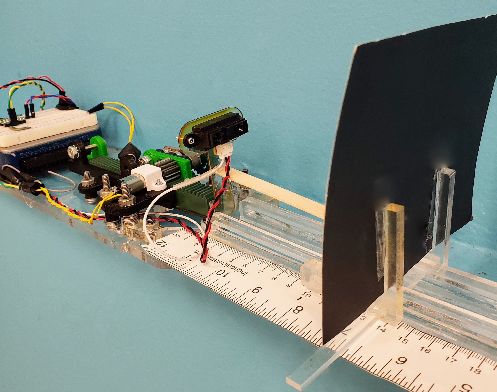

# Weld Follower

> Developing a PID contoller for a custom design robot. 

---

### Table of Contents

- [Weld Follower](#weld-follower)
    - [Table of Contents](#table-of-contents)
  - [Description](#description)
      - [Technologies](#technologies)
  - [Challenges](#challenges)

---

## Description

The system will keep a constant distance from the target. This is a prototype for a low cost linear follower. The challenge was becoming familiar with the labView interface and communicating with the electronics. 

#### Technologies

- Labview for UI and control design 
- National Instruments DAQ
- Noise reduction teqniues. 

[Back To The Top](#read-me-template)

---

## Challenges 
- Limiting the powerline noise on the system without using additional parts. 
- Signal conditioning while maximizing the response time of the system. 
- Interpreting electronics documentation for our use.  

[Back To The Top](#read-me-template)
